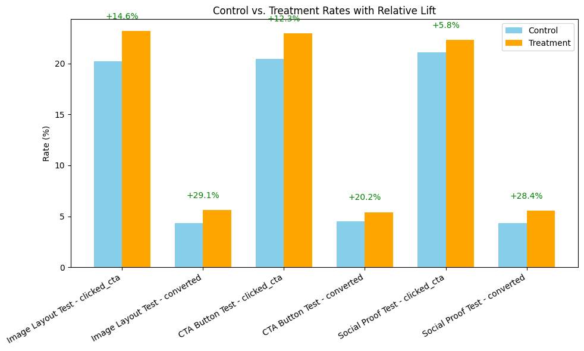
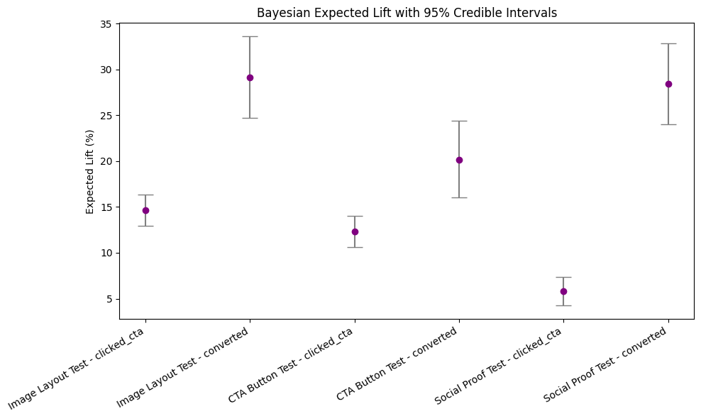
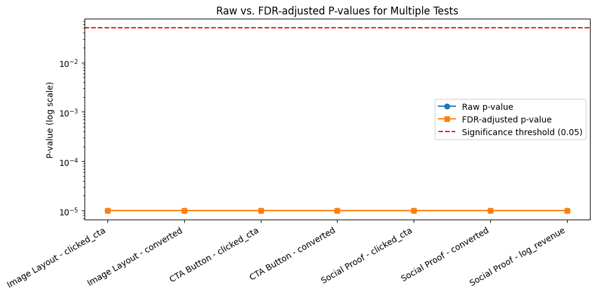

# Ecommerce AB Testing Analysis


This project aims to analyze the impact of three A/B tests - **Social Proof**, **CTA Button**, and **Image Layout** - on conversion rates and revenue. The goal is to understand how these changes impact and drive user engagement and revenue.

---

## Table of Contents 
1. [Notebooks](#notebooks)
2. [Data](#data)
3. [Results](#results)
4. [Key Visualizations](#key-visualizations)
5. [Requirements](#requirements)
6. [How to Run](#how-to-run)
7. [Key Insights](#key-insights)

--- 

## Notebooks

The analysis is structued into three notebooks: 
1. [1_data_generation](notebooks/01_Data_Generation.ipynb) -> Generates synthetic dataset
2. [2_EDA](notebooks/02_Exploratory_Data_Analysis.ipynb) -> Exploratory data analysis
3. [3_AB_Analysis](notebooks/03_A_B_Testing.ipynb) -> Conducts A/B tests and generates insights

--- 

## Data 

Synthetic datasets - users data and sessions data have been generated for this project. 

- Large datasets are hosted externally: [https://drive.google.com/drive/folders/167K6KEiO084Ayve1s2yxUQbxFZQ1jUwA?usp=sharing] 
- All datasets are downloadable and cen be opened locally.

---
 
## Results 

Excel summaries of the A/B test outcomes are included in the 'results/' folder

> Note: Some files may not render on GitHub due to size. Please download to view them locally.

## Key Visualizations 

- **Relative Lift (Frequentist):**


- **Bayesian Lift:**


- **FDR-adjusted P-values:**


 > Only a few key plots are included here. The other visualizations can be directly viewed on the notebooks.

--- 

## Requirements 

- Python 3.12.11 (or higher)
- Pandas
- Numpy
- Scipy
- Matplotlib
- Seaborn
- Statsmodels

Install dependencies with: 

```bash
pip install -r requirements.txt 
```

## How to Run 

1. Open the notebooks in Google Colab or Jupyter Notebook
2. Ensure that all dependencies are installed
3. Run the notebooks sequentially:
   1. Data Generation
   2. EDA
   3. A/B Testing Analysis


--- 

## Key Insights 

* Image Layout led to a 14.6% relative life in clicked CTA and a 29% relative lift in conversion rates
* CTA Button showed a relative lift of 12.3% and 20.2% in clicked-CTA and conversion rates respectively.
* Social Proof increased clicked-CTA with a relative lift of 5.8% and conversion rate by 28.4
* Bayesian expected lift with a 95% confidence intervals also seconds the result that the three experiments led to an increased user engagement and revenue.
* For conversion improvements, we need to prioritize Image Layout Test and Social Proof. On the other hand, CTA button and Image layout are more effective for CTA clicks.
* The p-values observed in raw and when FDR-adjusted attest to the fact that all the tests are statistically significant.
* Segmentation and Cohort Analysis also corroborate the findings across various user types and across different time periods. 


